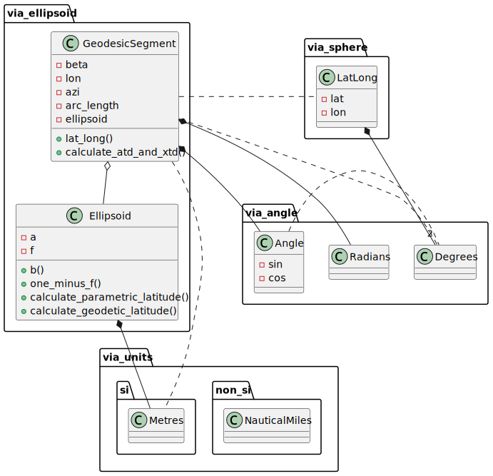
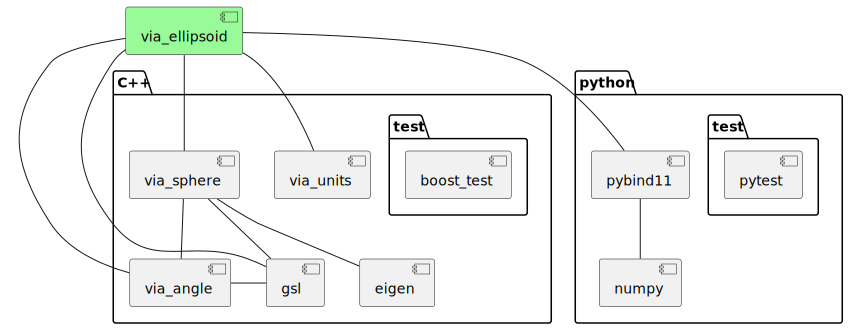

# via-ellipsoid-cpp

[](https://opensource.org/license/mit/)
[](https://github.com/kenba/via-ellipsoid-cpp/actions)
[](https://codecov.io/gh/kenba/via-ellipsoid-cpp)

A library for performing geometric calculations on the
[WGS-84](https://via-technology.aero/img/navigation/REF08-Doc9674.pdf)
ellipsoid, see *Figure 1*.


*Figure 1 The WGS-84 Ellipsoid (not to scale)
[Cmglee](https://commons.wikimedia.org/wiki/User:Cmglee), [CC BY-SA 4.0](https://creativecommons.org/licenses/by-sa/4.0), via Wikimedia Commons*

[WGS-84](https://via-technology.aero/img/navigation/REF08-Doc9674.pdf)
has become the de facto standard for satellite navigation since its adoption
by the Navstar Global Positioning System ([GPS](https://www.gps.gov/systems/gps/performance/accuracy/)) and the USA making GPS available for civilian use in 1983.

This library uses the WGS-84 primary parameters defined in Table 3-1 of the
[ICAO WGS-84 Implementation Manual](https://via-technology.aero/img/navigation/REF08-Doc9674.pdf).

## Geodesic navigation

The shortest path between two points on the surface of an ellipsoid is a
[geodesic segment](https://en.wikipedia.org/wiki/Geodesics_on_an_ellipsoid).
It is the equivalent of a straight line segment in planar geometry or a
[great circle arc](https://en.wikipedia.org/wiki/Great_circle) on the
surface of a sphere, see *Figure 2*.


*Figure 2 A geodesic segment (orange) and a great circle  arc (blue)*

This library uses the correspondence between geodesic segments on an ellipsoid
and great-circle arcs on an auxiliary sphere, together with 3D vectors to calculate:

- the length and azimuths of a geodesic segment between two positions;
- the along track and across track distances of a point relative to a geodesic segment;
- and the intersection of two geodesic segments.

See: [geodesic algorithms](https://via-technology.aero/navigation/geodesic-algorithms/).

## Design

The library is based on Charles Karney's [GeographicLib](https://geographiclib.sourceforge.io/) library.

Like `GeographicLib`, it models geodesic segments as great circle arcs on
the surface of a unit sphere. However, it also uses vectors to perform
calculations between geodesic segments.

The `Ellipsoid` class represents an ellipsoid of revolution.

The singleton `Ellipsoid::wgs84()` represents the WGS-84 `Ellipsoid` which is used
by the `GeodesicSegment` constructors to create `GeodesicSegment`s on the WGS-84 `Ellipsoid`.



*Figure 3 Class Diagram*

## Example

Create two `GeodesicSegment`s, each between two positions and then calculate the
distances from the geodesic segment start points to their intersection point.

The values are taken from Charles Karney's original solution to
[Intersection between two geodesic lines](https://sourceforge.net/p/geographiclib/discussion/1026621/thread/21aaff9f/#fe0a).

The expected latitude and longitude are from Karney's reply:

> Final result 54.7170296089477 -14.56385574430775

Note: Karney's solution requires all 4 positions to be in the same hemisphere
centered at the intersection point.
This solution does **not** have that requirement.

### C++
```C++
#include "via/ellipsoid.hpp"
#include <boost/test/unit_test.hpp>

using namespace via::ellipsoid;
using namespace via;

BOOST_AUTO_TEST_CASE(test_closest_intersection_point_karney) {
  // Second example from Baselga paper
  // Karney's example
  // Istanbul, Washington, Reyjavik and Accra
  const LatLong istanbul(Degrees(42.0), Degrees(29.0));
  const LatLong washington(Degrees(39.0), Degrees(-77.0));
  const LatLong reyjavik(Degrees(64.0), Degrees(-22.0));
  const LatLong accra(Degrees(6.0), Degrees(0.0));

  const GeodesicSegment<double> g1(istanbul, washington);
  const GeodesicSegment<double> g2(reyjavik, accra);

  const auto result1{
      calculate_intersection_point(g1, g2, units::si::Metres(1e-3))};
  BOOST_CHECK(result1.has_value());

  BOOST_CHECK_CLOSE(54.717029611, result1.value().lat().v(), 100 * 1e-3);
  BOOST_CHECK_CLOSE(-14.56385575, result1.value().lon().v(), 100 * 1e-3);

  // Swap geodesics
  const auto result2{
      calculate_intersection_point(g2, g1, units::si::Metres(1e-3))};
  BOOST_CHECK(result2.has_value());

  BOOST_CHECK_CLOSE(54.717029611, result2.value().lat().v(), 100 * 1e-3);
  BOOST_CHECK_CLOSE(-14.56385575, result2.value().lon().v(), 100 * 1e-3);
}
```

### Python
```Python
import pytest
from numpy.testing import assert_almost_equal
from via_angle import Angle, Degrees
from via_sphere import LatLong
from via_units import Metres
from via_ellipsoid import GeodesicSegment, calculate_intersection_point

def test_intersection_point_distance():
    # Karney's example:
    # Istanbul, Washington, Reyjavik and Accra
    # from:
    # <https://sourceforge.net/p/geographiclib/discussion/1026621/thread/21aaff9f/#fe0a>
    istanbul = LatLong(Degrees(42.0), Degrees(29.0))
    washington = LatLong(Degrees(39.0), Degrees(-77.0))
    reyjavik = LatLong(Degrees(64.0), Degrees(-22.0))
    accra = LatLong(Degrees(6.0), Degrees(0.0))

    g1 = GeodesicSegment(istanbul, washington)
    g2 = GeodesicSegment(reyjavik, accra)

    intersection_point_1 = calculate_intersection_point(g1, g2, Metres(1e-3))
    if intersection_point_1:
        assert_almost_equal(54.7170296089477, intersection_point_1.lat().v())
        assert_almost_equal(-14.56385574430775, intersection_point_1.lon().v())

    # Swap GeodesicSegments
    intersection_point_2 = calculate_intersection_point(g2, g1, Metres(1e-3))
    if intersection_point_2:
        assert_almost_equal(54.7170296089477, intersection_point_2.lat().v())
        assert_almost_equal(-14.56385574430775, intersection_point_2.lon().v())
```

## Use

The C++ software depends on:

* the [via-angle-cpp](https://github.com/kenba/via-angle-cpp) library;
* the [via-sphere-cpp](https://github.com/kenba/via-sphere-cpp) library;
* the [via-units-cpp](https://github.com/kenba/via-units-cpp) library;
* the [Eigen](https://gitlab.com/libeigen/eigen) linear algebra library;
* and the Microsoft [GSL](https://github.com/microsoft/GSL) library to provide [Contracts](https://isocpp.org/files/papers/P2900R6.pdf) support.

The C++ tests use the [boost.test](https://www.boost.org/doc/libs/1_86_0/libs/test/doc/html/boost_test/intro.html)
library, see *Figure 4*.


*Figure 4 Ellipsoid Dependencies*

### C++

#### Installation

The library is header only, so the library `include` directory just needs to be added to the include path.
Alternatively, when using [cmake](https://cmake.org/) the environment variable `ViaEllipsoid_DIR` just needs
to be set to the location of the `via-ellipsoid-cpp` directory; `cmake` will add it to the include path.

Note: `CMakeLists.txt` is setup to install python by default, so `-DINSTALL_PYTHON=OFF`
must be passed to `cmake` when building for C++.

`cmake` can also be used to install the library to the relevant include directory on Linux/macOS.
In the `via-ellipsoid-cpp` directory, run:

```bash
cmake -DINSTALL_PYTHON=OFF .
sudo make install
```

Note: it will be necessary to delete the `CMakeCache.txt` file created by
running `cmake` above, before running `cmake` on this library again.

#### Tests

The C++ tests can be built and run using `cmake` by running:

```bash
cmake -DCMAKE_EXPORT_COMPILE_COMMANDS=1 -DINSTALL_PYTHON=OFF -DCPP_UNIT_TESTS=ON <via-ellipsoid-cpp directory>
make
make test
```

Note: `-DCMAKE_EXPORT_COMPILE_COMMANDS=1` creates a `compile_commands.json`
file which can be copied back into the `via-ellipsoid-cpp` directory for
[clangd](https://clangd.llvm.org/) tools.

#### Accuracy Test

The accuracy test uses Charles Karney's
[Test data for geodesics](https://geographiclib.sourceforge.io/C++/doc/geodesic.html#testgeod) to verify geodesic azimuth and distance calculations between
positions on the WGS-84 ellipsoid.
Build and run the tests using:

```bash
cmake -DINSTALL_PYTHON=OFF -DCPP_UNIT_TESTS=ON -DCPP_ACCURACY_TEST=ON <via-ellipsoid-cpp directory>
make
make test
```

#### Performance Tests

The performance tests uses Charles Karney's
[Test data for geodesics](https://geographiclib.sourceforge.io/C++/doc/geodesic.html#testgeod)
to measure
the runtime performance of calculating geodesic segments and geodesic intersections.

Build and run the tests using:

```bash
cmake -DINSTALL_PYTHON=OFF -DCPP_UNIT_TESTS=ON -DCPP_PERFORMANCE_TESTS=ON -DCMAKE_BUILD_TYPE=Release <via-ellipsoid-cpp directory>
make
make test
```

Note: some tests can also be performed using Charles Karney's [GeographicLib](https://geographiclib.sourceforge.io/) library by adding the cmake flag
`-DUSE_GEOGRAPHICLIB=ON`.

### Python

The library uses [pybind11](https://github.com/pybind/pybind11) to provide C++ Python bindings
and [scikit-build](https://pypi.org/project/scikit-build/) to build a python package using
[cmake](https://cmake.org/).

From the parent directory of `via-ellipsoid-cpp`:

```bash
pip install ./via-ellipsoid-cpp
```

In Python code import the software as `via_ellipsoid`, e.g.:

```python
from via_angle import Degrees
from via_sphere import LatLong
from via_units import Metres
from via_ellipsoid import GeodesicSegment, calculate_intersection_point
```
Note: `via_angle`, `via_sphere` and `via_units` must also be imported for the
units used by the `via_ellipsoid` software.

See: [test_GeodesicSegment.py](python/tests/test_GeodesicSegment.py).

## License

`via-ellipsoid-cpp` is provided under a MIT license, see [LICENSE](LICENSE).
